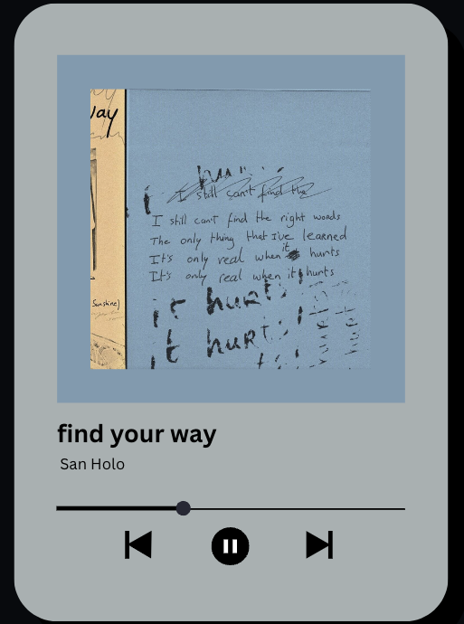

<h1 align="center">Hi! My name is Jianqing Ma </h1>
 

Welcome to my github page! I'm Jianqing, a fullstack developer in Boston, MA. 

### 🧐 More About Me:

-   ✨ &nbsp; MBTI Type: **INTJ** -- if you know, you know
-   📚 &nbsp; I’m currently a graduate student at Khoury College of Computer Science, Northeastern University; I'll graduate in December this year.
-   ❓ &nbsp; I'm in the life period of self-discovery. I've trained myself to be more adaptable, but I feel the need to concentrate on a single field to deepen my expertise at this stage.
-   🌱 &nbsp; I'm currently learning **Typescript**; always excited about something new.
-   🔍 &nbsp; I'm also actively exploring the world of **Machine Learning** — I'm especially interested in LLM and we need to keep on track:).
-   🤖 &nbsp; You can check out my previous and ongoing projects on [GitHub Repository](https://github.com/jianqing77?tab=repositories).
-   🤝 &nbsp; I would love to collaborate on my new project, [Vinyland](https://github.com/jianqing77/Vinyland).
-   🐶 &nbsp; Dog lover FOREVER.
-   📷 &nbsp; I'm passionate about photography — capturing some precious moments and tell others about the story.
-   ⚡ Fun fact: &nbsp; I brush my teeth more than three times per day.
-   ⭐ &nbsp; Feel free to check out my portfolio website: [Jianqing Ma](https://jianqing-portfolio.vercel.app/)
-   📫 &nbsp; Let's connect! Leave me a message on [LinkedIn](https://www.linkedin.com/in/jianqing-ma/).

### 🔨 Languages and Tools:

  
  
  
  
  
  
  
  
  
  
  
  
  
  
  
  
  
  
  
  
  
  
  
  
  
  
  
  
  
  
  
  
  

### 📊 Github Stats

<a href='https://github.com/jianqing77/github-stats-transparent'>
  

<!-- 

 -->

 
